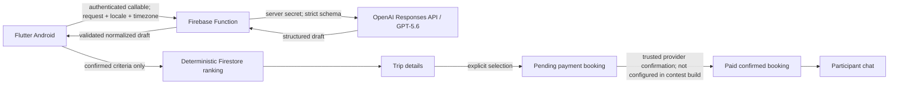
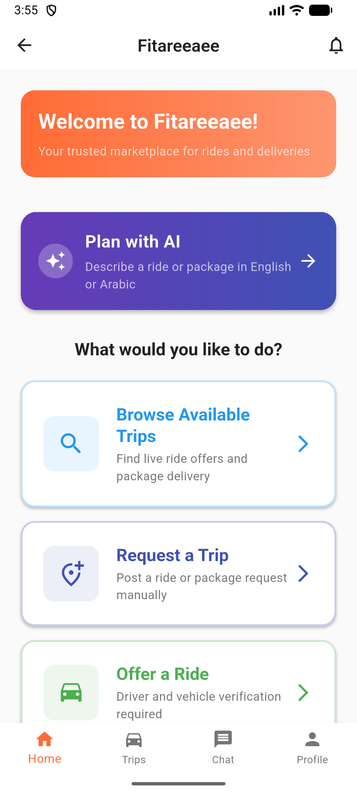
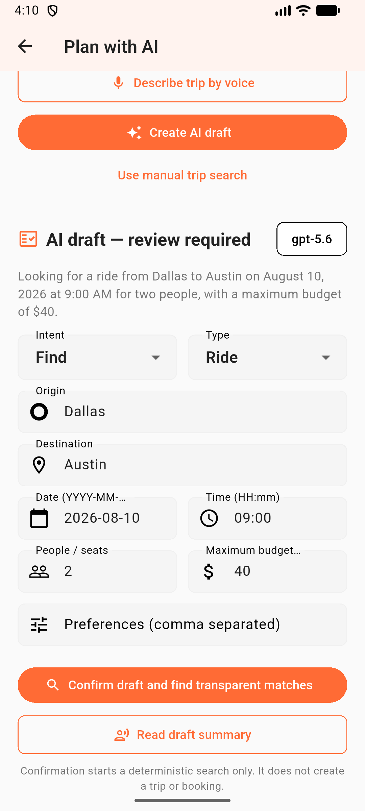
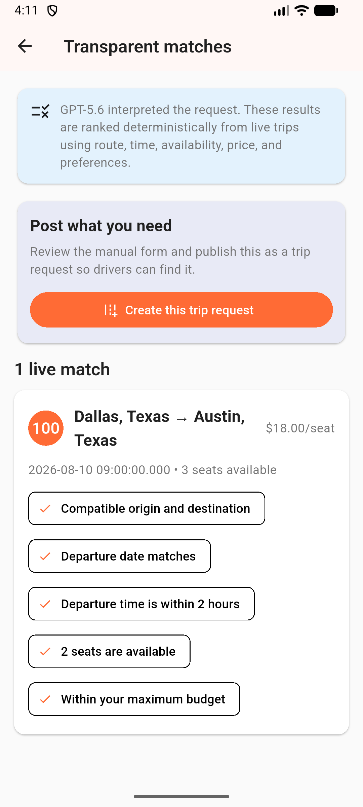

# Fitareeaee Copilot

**Trusted, natural-language ride and package matching**

Fitareeaee Copilot turns an everyday ride or package-delivery request in English or Arabic into a structured draft, lets the user review every field, and then ranks real community trips with transparent reasons. It is an Android/Flutter submission for OpenAI Build Week in the **Apps for Your Life** track.

## The problem

Finding a compatible community ride often means translating a conversational need—route, time, seats, budget, package size, and preferences—into many form fields and opaque search results. That burden is harder across languages and on a phone.

Fitareeaee Copilot makes intent entry conversational while keeping consequential actions deterministic and user-controlled:

- GPT-5.6 interprets the request into a strict draft.
- The user reviews and edits the draft before confirmation.
- Local deterministic code ranks only real Firestore trips.
- Each result explains route, date/time, capacity, price, and preference compatibility.
- Booking is a separate explicit action enforced by a server-side transaction.

## Build Week extension versus pre-existing work

Fitareeaee was an existing Flutter marketplace prototype before Build Week. The baseline is preserved at tag `build-week-preexisting-baseline` and documented in [`docs/PRE_BUILD_WEEK_BASELINE.md`](docs/PRE_BUILD_WEEK_BASELINE.md). It is not claimed as contest work.

| Before Build Week | Built during Build Week |
| --- | --- |
| Flutter authentication, trip/profile screens, chat and verification prototypes | Prominent Home → Plan with AI experience |
| Manual trip browsing and inconsistent prototype paths | English/Arabic natural-language ride and package drafting |
| Legacy OpenRouter and unused AI-verification prototypes | Official OpenAI SDK + Responses API + GPT-5.6 callable |
| Client-side/non-transactional booking paths | Authenticated server-authoritative transactional booking |
| Broad/inconsistent data access | Default-deny Firestore/Storage rules and admin-only verification decisions |
| Simulated payment, wallet, map and tracking surfaces | Finance/tracking prototypes excluded; interactive manual trip map picker added |
| Six domain smoke tests | Copilot, booking, verification, authorization and ranking contracts |

The append-only evidence log is [`docs/BUILD_WEEK_PROGRESS.md`](docs/BUILD_WEEK_PROGRESS.md), and the detailed change list is [`docs/BUILD_WEEK_CHANGELOG.md`](docs/BUILD_WEEK_CHANGELOG.md).

## Judge path

1. Sign in with the supplied free judge account.
2. Tap **Plan with AI** on Home.
3. Enter an English or Arabic ride/package request.
4. Review and edit the clearly labeled AI draft.
5. Confirm the criteria to rank real seeded trips.
6. Open a transparent match and view manual verification context.
7. Create or select a match. The server records it as **payment required**, not
   confirmed; seats and chat remain locked.
8. Use the seeded paid/confirmed judge fixture to demonstrate participant chat.

Users can also create a request or verified-driver offer manually. The shared
form supports ride/package details, accessibility preferences, origin and
destination pins on an interactive OpenStreetMap, and explicit review before a
server-authoritative write. Copilot additionally accepts English or Arabic
speech-to-text and can announce the returned draft through Android accessibility
services. Those conveniences never bypass the same confirmation, role, payment,
or verification rules.

That booking path applies to a rider/sender finding an offered trip. An **offer**
draft instead ranks compatible request listings; a manually verified driver can
submit a bounded proposal. The rider chooses a proposal and becomes the paying
party; the driver never pays. Selection creates only a pending-payment state.

No real payment provider is configured for the contest build, so the app never
pretends that money moved. A trusted payment-provider webhook would be required
to transition a new booking to paid/confirmed and unlock inventory and chat. See
[`docs/JUDGE_TESTING.md`](docs/JUDGE_TESTING.md) for the seeded demo path.

## Architecture



The code requires `OPENAI_API_KEY` only as a managed Firebase Functions secret;
the Flutter app never receives it. The Copilot callable is deployed with an
authenticated, strict-schema boundary. Its capped live smoke matrix passed for
an English ride, an English package, and an Arabic ride request. The callable
requires Firebase Authentication, limits input/output, redacts likely contact
details, applies per-user throttling, validates the model result again on the
server, and maps failures to safe messages.

GPT-5.6 interprets language; it does not select a person, approve identity, declare anyone safe, guarantee availability, save a trip, or book. Deterministic ranking complements AI interpretation because route, time, seats, budget, and preference scores are reproducible and explainable.

## Judge preview

| Home | Reviewable GPT-5.6 draft | Transparent live match |
| --- | --- | --- |
|  |  |  |

[View the complete judge-safe screenshot set](docs/screenshots/README.md), including
manual map selection, the payment/chat boundary, completed Past trips, and the
[editable architecture graphic](docs/ARCHITECTURE.svg).

## Privacy and safety

- Only the redacted natural-language request, locale, timezone, and a
  server-generated current date are sent to OpenAI.
- App user IDs, account emails/phones, profiles, bookings, chat contents, and
  verification images are not sent to OpenAI.
- Email addresses, URLs, and long numeric strings typed into a request are
  redacted server-side; users are still instructed not to enter sensitive data.
- Signed-in marketplace reads use minimal `public_profiles` and `public_trips`
  projections; private user records, exact trip coordinates, passenger IDs,
  package photos, and arbitrary metadata are not exposed by those projections.
- Every model result is an **AI draft — review required**.
- Identity and selfie decisions remain manual/admin controlled.
- Empty Firestore results stay empty; the app never invents live trips.
- Payments, escrow, wallets, payouts, turn-by-turn tracking, and AI identity verification are excluded.

Full boundaries and limitations are in [`docs/PRIVACY_AND_SAFETY.md`](docs/PRIVACY_AND_SAFETY.md).

## Local setup

### Requirements

- Flutter stable with Dart 3.10-compatible tooling
- Android SDK/emulator or Android phone with USB debugging
- Node.js 20 and npm
- Firebase CLI
- Access to the intended Firebase project: `fitareeaee`

### Android Firebase configuration

Place the Android config for package `com.fitareeaee.app` at:

```text
android/app/google-services.json
```

That file is ignored and must never be committed. Startup verifies that the native configuration resolves to project ID `fitareeaee`.

### Functions and OpenAI secret

```powershell
cd functions
npm ci
npm run build
cd ..
firebase functions:secrets:set OPENAI_API_KEY --project fitareeaee
```

Enter the key only in Firebase CLI's private prompt. Never place it in Dart, `.env`, documentation, Android resources, logs, or Git. Deploy only after tests pass:

```powershell
firebase deploy --only "functions:planTripWithCopilot" --project fitareeaee
firebase deploy --only "firestore:rules,storage" --project fitareeaee
```

The live `fitareeaee` project contains inherited pre-Build-Week Functions and
indexes. Do not use an unscoped `--only functions` deployment or deploy the
index manifest there unless the resulting deletion plan has been explicitly
reviewed and approved. The two judge-path message indexes were added
non-destructively and are already `READY`. A full Functions/index deployment is
appropriate only for a fresh project or after owner-approved legacy retirement.

### Run and verify

```powershell
flutter pub get
dart format --output=none --set-exit-if-changed lib test
flutter analyze
flutter test
cd functions
npm test
npm run build
cd ..
firebase emulators:exec --only "firestore,storage" "npm --prefix functions run test:rules" --project fitareeaee
firebase emulators:exec --only "auth,functions,firestore" "npm --prefix functions run test:integration:booking" --project fitareeaee
flutter build apk --debug
```

### Maintainer-only judge fixtures

Create two dedicated Firebase Auth accounts outside Git, then run the guarded
seeder using only their UIDs and privileged Application Default Credentials:

```powershell
$env:GOOGLE_CLOUD_PROJECT='fitareeaee'
$env:JUDGE_DRIVER_UID='<existing-driver-auth-uid>'
$env:JUDGE_RIDER_UID='<existing-rider-auth-uid>'
npm --prefix functions run seed:judge
```

The script refuses any other project or identical/invalid UIDs, never accepts a
password, and only upserts fixed `build_week_judge_*` private/public trip
fixtures, two explicitly fictional verification summaries, two minimal public
profiles, and labeled active/completed booking/chat lifecycle fixtures. Rerunning
may reset those fixture documents; it must never be used as a general
production-data migration.

The current universal profile APK is available from the
[v1.0.5 GitHub Release](https://github.com/MoazGamalMohamed/fitareeaee-copilot/releases/tag/fitareeaee-copilot-v1.0.5).
It is 83,378,603 bytes with SHA-256
`0BFCB8E7712F0EA4CBEFBC6F9D7AB83A68B3CEDAB207D8EC158ECF6424D8DB64`.
The published asset was downloaded, hash-matched, installed, and cold-launched
on a Motorola Moto G Play (2024). Authenticated Home, the paid-confirmed-only
Chat empty state, and manual Request a Trip form rendered without the former
Firestore failure or matching app crash logs. The judge artifact is debug-signed
for sideloading because no private release-signing configuration is available;
no signing secret is committed.

The superseding
[v1.0.11 prerelease](https://github.com/MoazGamalMohamed/fitareeaee-copilot/releases/tag/fitareeaee-copilot-v1.0.11)
separates rider/sender requests from driver/courier offers, moves the role-specific
creation action into Home's bottom navigation, adds a circular Plan with AI action,
and hardens English/Arabic voice planning with explicit Android consent and a
three-minute cap. Profile locations now support editable suggestions, country
selection, manual entry, and an interactive map pin. Its public 109,583,813-byte APK
was anonymously redownloaded, byte-matched at SHA-256
`54E60FE42884A8EFB7FAB8C76DA21F9F43D2C4A2BA55A21C6DA3DACFBCC44EDD`,
installed, authenticated, and smoke-tested on API 36. It remains a prerelease until
that exact public download passes the physical-phone smoke; v1.0.5 remains the
phone-tested rollback.

## Codex collaboration

Codex audited the inherited repository, preserved an honest baseline, checked current official rules and OpenAI guidance, implemented the new vertical slice, wrote security contracts, repeatedly ran the complete gate, built and smoke-tested Android APK checkpoints, and maintained the append-only evidence record. Human decisions defined the problem, track, safety boundaries, product name, Firebase project, budget cap, release authority, and final legal submission.

## Documentation

- [`docs/JUDGE_TESTING.md`](docs/JUDGE_TESTING.md) — free judge walkthrough
- [`docs/TEST_MATRIX.md`](docs/TEST_MATRIX.md) — test evidence and pending external checks
- [`docs/DEMO_SCRIPT.md`](docs/DEMO_SCRIPT.md) — 2:40 demo script
- [`docs/DEVPOST_SUBMISSION.md`](docs/DEVPOST_SUBMISSION.md) — submission copy
- [`docs/SUBMISSION_CHECKLIST.md`](docs/SUBMISSION_CHECKLIST.md) — final manual actions
- [`docs/BUILD_WEEK_PROGRESS.md`](docs/BUILD_WEEK_PROGRESS.md) — append-only checkpoints
- [`docs/PUBLICATION_HISTORY.md`](docs/PUBLICATION_HISTORY.md) — original-to-sanitized commit map
- [`docs/PLAY_STORE_READINESS.md`](docs/PLAY_STORE_READINESS.md) — Android/Google Play readiness gaps
- [`docs/THIRD_PARTY_NOTICES.md`](docs/THIRD_PARTY_NOTICES.md) — dependency, map-data, and tile-service notices

- [`docs/RESUME_HERE.md`](docs/RESUME_HERE.md) — current recovery checkpoint and exact next action
- [`docs/DECISION_LOG.md`](docs/DECISION_LOG.md) — consequential scope and safety decisions

## Known limitations

- This contest build supports Android sideloading, not Google Play distribution.
- Manual trip creation includes an interactive map pin picker, but matching still
  uses deterministic route/date/capacity criteria rather than a routing or
  geocoding service; turn-by-turn navigation is not included.
- Standard OpenStreetMap tiles are a best-effort contest dependency with no SLA;
  the app shows permanent linked attribution, uses an identifying User-Agent,
  honors HTTP cache headers, and does not prefetch or offer offline maps.
- It does not implement real payments or emergency dispatch.
- Verification indicates an admin-reviewed workflow, not a guarantee of personal safety.
- Live GPT-5.6 and physical-phone results are recorded only after their corresponding credential/device checks actually pass.

Final judge source:
[agent/payment-gated-chat-trip-support](https://github.com/MoazGamalMohamed/fitareeaee-copilot/tree/agent/payment-gated-chat-trip-support).
Public repository and non-sensitive support:
[github.com/MoazGamalMohamed/fitareeaee-copilot](https://github.com/MoazGamalMohamed/fitareeaee-copilot)
and its Issues tab. Draft PR #1 remains deliberately unmerged pending owner approval.

## License

MIT — see [`LICENSE`](LICENSE).
